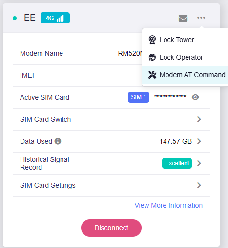

# GL.iNet Spitz/Puli GPS Streamer


A hopefully simple way to stream and save GPS data from GL.iNet GL-X3000 (Spitz) or GL-XE3000 (Puli) routers to a self-hosted monitoring stack. Basically turns your mobile router into a GPS tracker that feeds data into InfluxDB and visualizes it with Grafana.

It works, but it's definitely not perfect, so any suggestions or PR's are welcome!

## Prerequisites

### Hardware Requirements
- GL.iNet GL-X3000 (Spitz) or GL-XE3000 (Puli) router with 5G module and GPS antenna
- Server capable of running Docker (Proxmox VM, cloud instance, or local machine)

### GPS Configuration on Router

Source for the information below: https://forum.gl-inet.com/t/howto-gl-x3000-gps-configuration-guide/30260

Before using this GPS streamer, you need to enable GPS on your GL.iNet router's 5G modem. SSH into your router and run these AT commands via the admin interface or command line.

The easiest way is to go to the Admin Panel, three dots and then "Modem AT Command":



In the window that pops up, just paste each line and click Send. You should get an OK for each command:


**Step 1: Enable GPS on the 5G modem**
```bash
# Enable GPS autostart and begin acquisition
AT+QGPSCFG="autogps",1
AT+QGPS=1
```

This configures the GPS to automatically start on boot and immediately begin streaming NMEA sentences to `/dev/mhi_LOOPBACK`.

**Step 2: (Optional) Configure GNSS constellations**

For better accuracy, you can enable additional satellite constellations (I personally enabled all commands):
```bash
# Enable Glonass, Galileo, Beidou NMEA sentence output
AT+QGPSCFG="glonassnmeatype",1
AT+QGPSCFG="galileonmeatype",1
AT+QGPSCFG="beidounmeatype",1

# Enable all GNSS constellations (0=GPS only, 1=all)
AT+QGPSCFG="gnssconfig",1
```

**Step 3: Verify GPS is working**
```bash
# Check that NMEA data is flowing
cat /dev/mhi_LOOPBACK | head -10
```

You should see NMEA sentences like `$GPGGA`, `$GPRMC`, etc. streaming from the device.

### Network Setup
You need **Tailscale** installed and configured on both (to be honest, you can probably also use ZeroTier or anything else that lets your modem and server talk to eachother):

- Your GL.iNet Spitz/Puli router (sending GPS data)
- Your receiving system (Proxmox VM, Cloud VPS, or local machine running the Docker stack)

This allows the router to securely communicate with your server regardless of network topology, it's much easier this way.

## How It Works

The project consists of two main components:

### Router Side (stream_gps.sh)
- Runs on the GL.iNet router and reads raw NMEA GPS sentences from `/dev/mhi_LOOPBACK`
- Batches the GPS data (configurable batch size) and POSTs it to your server via HTTP
- Includes retry logic, basic NMEA validation, and logging
- Analyzes sentence types (GPGGA, GPRMC, GPGSV, etc.) for better debugging

### Server Side (FastAPI + Docker Stack)
- **FastAPI server** (`main.py`) receives GPS data, parses NMEA sentences using `pynmea2`, and writes structured data to InfluxDB
- **InfluxDB** stores time-series GPS data (position, altitude, speed, satellite info, DOP values)
- **Grafana** provides real-time visualization with maps, charts, and GPS metrics

The FastAPI server processes various NMEA sentence types:
- `GPGGA` - Position, altitude, fix quality, satellites
- `GPRMC` - Position, speed, course over ground
- `GPGSV` - Satellite information and signal strength
- `GPGSA` - DOP (Dilution of Precision) and active satellites
- `GPVTG` - Track and ground speed

## Setup Instructions

### 1. Server Setup (Docker Stack)

Clone this repository and navigate to the server setup directory:

```bash
git clone https://github.com/linkev/Spitz-Puli-GPS-Streamer.git
cd Spitz-Puli-GPS-Streamer/server-setup
```

Start the stack with Docker Compose:

```bash
docker-compose up -d
```

This launches:
- **GPS Streamer Service** (port 9999) - FastAPI server for receiving GPS data
- **InfluxDB** (port 8086) - Time-series database with admin credentials `admin:GL.iNet-gps123`
- **Grafana** (port 3000) - Visualization dashboard with admin credentials `admin:admin`

### 2. Router Configuration

#### Easy Installation (Recommended)

SSH into your GL.iNet router and download the installer:

```bash
# Using curl
curl -sSL https://raw.githubusercontent.com/linkev/Spitz-Puli-GPS-Streamer/main/install.sh -o install.sh
```

```bash
# Or using wget
wget https://raw.githubusercontent.com/linkev/Spitz-Puli-GPS-Streamer/main/install.sh
```

Make it executable and run:

```bash
chmod +x install.sh
./install.sh
```

The installer will:
- Download and set up the GPS streaming script
- Ask for your server IP address and configuration
- Create a service manager for easy control
- Test GPS functionality
- Set up automatic startup (optional)

#### Managing the GPS Streamer

After installation, you can manage the GPS streamer using the interactive menu:

```bash
/root/gps-streamer/install.sh menu
```

The interactive menu provides 12 options (0-11) for complete GPS streamer management:

1. **Start GPS streaming service** - Starts the GPS data streaming to your server
2. **Stop GPS streaming service** - Stops the GPS streaming service
3. **Restart GPS streaming service** - Restarts the service (useful after configuration changes)
4. **Check service status** - Shows current service status and process information
5. **View live GPS stream** - Displays raw NMEA data from GPS (30-second timeout)
6. **View service logs** - Shows the last 50 lines of GPS streamer logs
7. **Edit configuration** - Modify server IP, port, and batch size settings
8. **Test GPS functionality** - Tests GPS device accessibility and data flow (10-second test)
9. **Enable auto-start on boot** - Configure service to start automatically when router boots
10. **Disable auto-start on boot** - Disable automatic startup
11. **Uninstall GPS streamer** - Completely remove the GPS streamer installation
0. **Exit** - Exit the management menu

#### Command Line Interface

You can also use direct commands for automated or scripted management:

```bash
# Installation and setup
/root/gps-streamer/install.sh install    # Install GPS streamer (default if no command given)

# Service management
/root/gps-streamer/install.sh start      # Start GPS streaming service
/root/gps-streamer/install.sh stop       # Stop GPS streaming service  
/root/gps-streamer/install.sh restart    # Restart GPS streaming service

# Monitoring and diagnostics
/root/gps-streamer/install.sh status     # Check service status and running processes
/root/gps-streamer/install.sh test       # Test GPS device functionality and data flow

# Configuration
/root/gps-streamer/install.sh config     # Edit server configuration (IP, port, batch size)

# System management
/root/gps-streamer/install.sh menu       # Launch interactive management menu
/root/gps-streamer/install.sh uninstall  # Remove GPS streamer completely
```

#### Command Details

- **install**: Downloads the GPS streaming script, configures server settings, creates service files, and tests GPS functionality
- **start**: Starts the GPS streaming service using the OpenWrt procd service manager
- **stop**: Stops the GPS streaming service and kills any remaining processes
- **restart**: Performs a clean stop followed by start (includes 2-second delay)
- **status**: Checks PID file, process status, and displays running stream_gps.sh processes
- **test**: Verifies GPS device accessibility, reads 10 seconds of GPS data, and displays sample NMEA sentences
- **config**: Interactive configuration editor for server IP, port, batch size, and retry delay settings
- **menu**: Full-featured interactive menu with all management options
- **uninstall**: Stops service, disables auto-start, removes all files and directories (requires confirmation)

#### Manual Installation (Advanced Users)

If you prefer manual setup, copy `stream_gps.sh` to your GL.iNet router, then use `nano` to edit the hardcoded Server IP. Then just run it manually or setup a service.

### 3. Access and Monitoring

- **Grafana Dashboard**: http://[server-ip]:3000 (admin:admin)
- **InfluxDB UI**: http://[server-ip]:8086 (admin:GL.iNet-gps123)
- **API Health Check**: http://[server-ip]:9999/health
- **GPS Statistics**: http://[server-ip]:9999/stats

The Grafana dashboard includes:
- Real-time GPS tracking map with location trails
- Speed monitoring (MPH/KMH)
- Altitude tracking
- Satellite count and signal quality
- GPS fix quality and precision metrics
- Course over ground visualization

## Configuration

### Environment Variables (Docker)
- `INFLUXDB_URL` - InfluxDB connection URL
- `INFLUXDB_TOKEN` - Authentication token
- `INFLUXDB_ORG` - Organization name
- `INFLUXDB_BUCKET` - Data bucket name
- `LOG_LEVEL` - Logging verbosity (DEBUG/INFO/WARN/ERROR)

### Router Script Variables
- `SERVER_IP` - Your server's IP address (use Tailscale IP)
- `SERVER_PORT` - Server port (default: 9999)
- `BATCH_SIZE` - Number of NMEA sentences per batch (default: 10)
- `RETRY_DELAY` - Seconds between retry attempts (default: 5)

## Troubleshooting

### Common Issues

**Installation fails to download**: Ensure your router has internet connectivity and can reach GitHub. Try the wget version if curl fails.

**Router can't reach server**: Verify Tailscale is running on both devices and they can ping each other.

**No GPS data**: Check that the GPS antenna is connected and the router has a GPS fix. Use the installer's test function: `/root/gps-streamer/install.sh test`

**Service won't start**: Check GPS configuration using the menu option "Test GPS functionality" or run the AT commands again.

**InfluxDB connection issues**: Ensure the Docker stack is running and InfluxDB is accessible on port 8086.

**Grafana shows no data**: Check that the InfluxDB datasource is configured correctly and data is being written to the `gps_data` bucket.

### Debugging Commands

**Using the installer's built-in tools:**
```bash
# Test GPS device functionality
/root/gps-streamer/install.sh test

# Check service status
/root/gps-streamer/install.sh status

# View live GPS stream
/root/gps-streamer/install.sh menu  # Option 5

# Check service logs
/root/gps-streamer/install.sh menu  # Option 6
```

**Manual debugging:**
```bash
# Check GPS device on router
cat /dev/mhi_LOOPBACK | head -10

# Monitor service logs
tail -f /root/gps-streamer/logs/stream.log

# Test server connectivity
curl http://[server-ip]:9999/health
```

**Server-side debugging:**
```bash
# Monitor server logs
docker-compose logs -f GL.iNet-gps-streamer

# Test API endpoint
curl http://[server-ip]:9999/health
```

## Architecture Notes

This was thrown together as a weekend project, so expect some rough edges. The NMEA parsing is fairly robust, but error handling could be improved. The InfluxDB schema is designed for time-series analysis but might not be optimal for all use cases.

The install script is a buggy mess.

The system handles GPS data loss gracefully and will retry failed transmissions. Batch processing reduces HTTP overhead while maintaining reasonable real-time updates.

## License

MIT License - see LICENSE file for details.